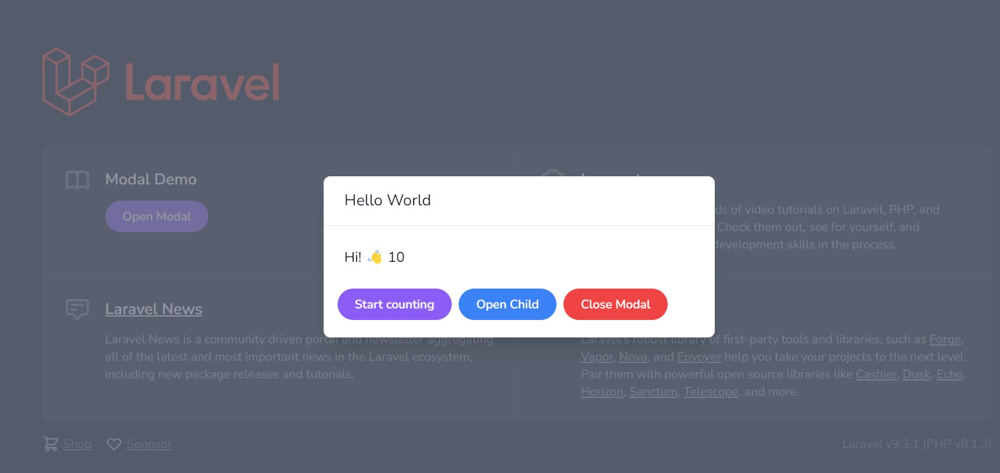

# Modal app

This project is based
on [How to build modals with Laravel and Livewire](https://philo.dev/laravel-modals-with-livewire/) by Philo Hermans,
this app demonstrates how to use [wire-elements/modal](https://github.com/wire-elements/modal) to create a basic modal.
How to open, close and pass parameters.



## Files

The following files form the basis of the tutorial, the components are heavily commented from the tutorial:

Modal:

- resources/views/vendor/livewire-ui-modal/modal.blade.php

Modal component:

- resources/views/components/modal.blade.php

Livewire:

- app/Http/Livewire/HelloWorld.php
- resources/views/livewire/hello-world.blade.php
- app/Http/Livewire/ChildModal.php
- resources/views/livewire/child-modal.blade.php

## Local installation

### Requirements

This is a Laravel 9 project. The requirements are the same as a
new [Laravel 9 project](https://laravel.com/docs/9.x/installation) with Livewire and wire-elements/modal

- [8.0+](https://www.php.net/downloads.php)
- [Composer](https://getcomposer.org)

Recommended:

- [Git](https://git-scm.com/downloads)

### Clone

See [Cloning a repository](https://help.github.com/en/articles/cloning-a-repository) for details on how to create a
local copy of this project on your computer.

e.g.

```sh
clone git@github.com:Pen-y-Fan/modal-app.git
```

### Install

Install all the dependencies using composer

```sh
cd modal-app
composer install
```

### Create .env

Create an `.env` file from `.env.example`

```shell script
cp .env.example .env
```

### Generate APP_KEY

Generate an APP_KEY using the artisan command

```shell script
php artisan key:generate
```

### Configure Laravel

There is no need to configure a database.

## Contributing

This is a **personal project**. Contributions are **not** required. Anyone interested in developing this project are
welcome to fork or clone for your own use.

## Credits

- [Michael Pritchard \(AKA Pen-y-Fan\)](https://github.com/pen-y-fan).
- Philo Hermans - based on the
  blog [How to build modals with Laravel and Livewire](https://philo.dev/laravel-modals-with-livewire/)

## License

MIT License (MIT). Please see [License File](LICENSE.md) for more information.
